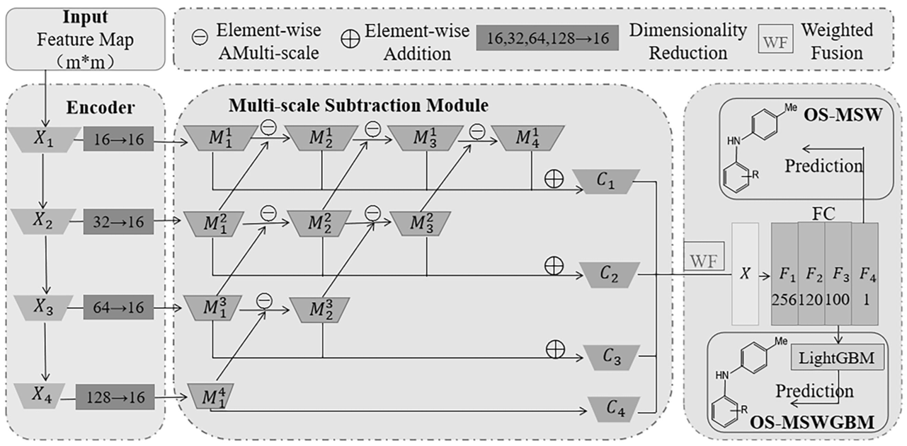

# OCS-TGBM

## Overview



This repository is the official implementation for our
paper "[OS-MSWGBM: Intelligent Analysis of Organic Synthesis Based on Multiscale Subtraction Weighted Network and LightGBM](https://match.pmf.kg.ac.rs/electronic_versions/Match93/n1/match93n1_5-40.pdf)".
Organic synthesis plays a vital role in optimizing existing drugs and innovating new drugs. As a significant and
challenging research frontier in the field of organic synthesis, cross-coupling reactions have also attracted
considerable attention. In the past few years, machine learning has realized great potential in predicting the
performance of cross-coupling reactions. However, most of the existing machine learning predictions are based on the
two-dimensional feature information of the cross-coupling reactions. In order to obtain the coupling reaction feature in
a multifaceted way, we exploit the three-dimensional features of the molecules based on the molecular stick-and-ball
model and the persistent homology analysis of topological data, respectively. On this basis, a weighted light
convolutional neural network with multi-scale subtraction (OS-MSW) is proposed to extract the deep abstract features of
the input data, and the extracted abstract features are applied to LightGBM for yield prediction, thus constructing a
highly efficient prediction system OS-MSWGBM. In addition, the interpretability of the OS-MSW model is analyzed in this
paper. The experiments demonstrate that OS-MSWGBM exhibits higher efficiency and more accurate prediction results, as
well as notably stable prediction performance, which can provide reliable decision-making information for experimental
personnel or organizations.

## Cite

If you find this repository useful, please consider citing our paper by the following BibTeX entry.

```latex
@article{os-mswgbm,
  title={OS-MSWGBM: Intelligent Analysis of Organic Synthesis Based on Multiscale Subtraction Weighted Network and LightGBM},
  author={Wang, Lanfeng and Guo, Yanhui and Zhang, Zelin and Qin, Meng'en and Li, Zixin and Sun, Xiaoli and Yang, Xiaohui},
  journal={MATCH-COMMUNICATIONS IN MATHEMATICAL AND IN COMPUTER CHEMISTRY},
  volume={93},
  number={1},
  year={2025},
  publisher={UNIV KRAGUJEVAC, FAC SCIENCE PO BOX 60, RADOJA DOMANOVICA 12, KRAGUJEVAC~…}
}
```

## License

This project is released under the [MIT license](LICENSE)
